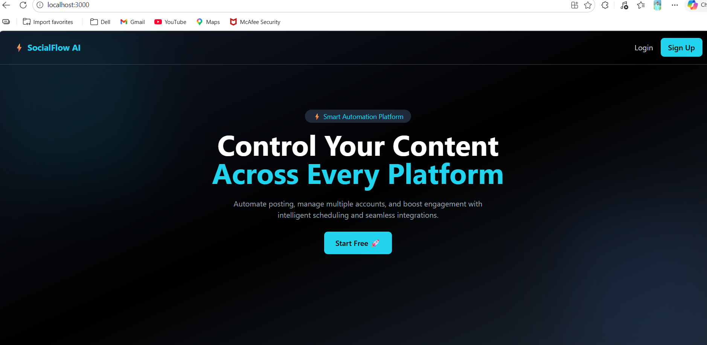
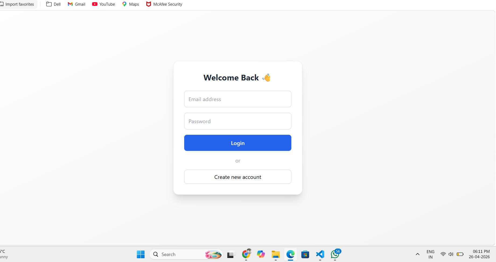
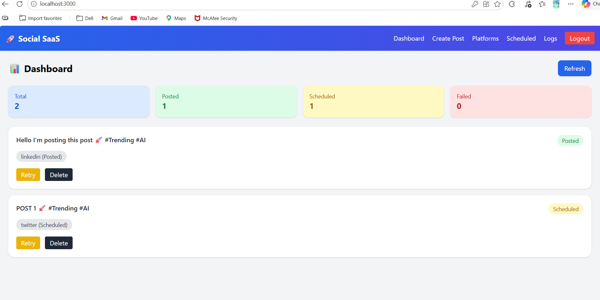
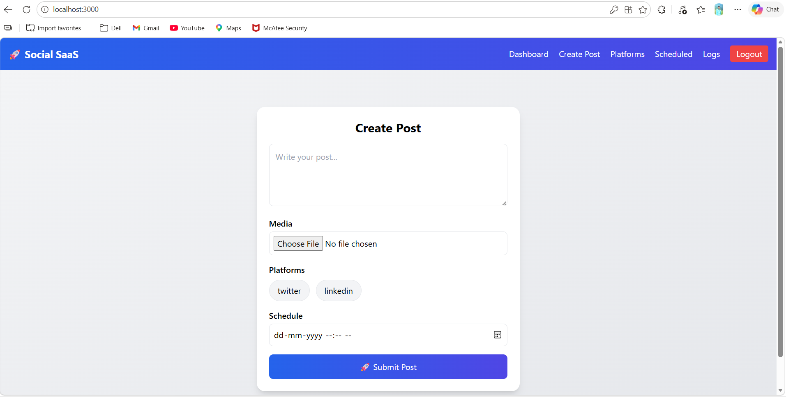
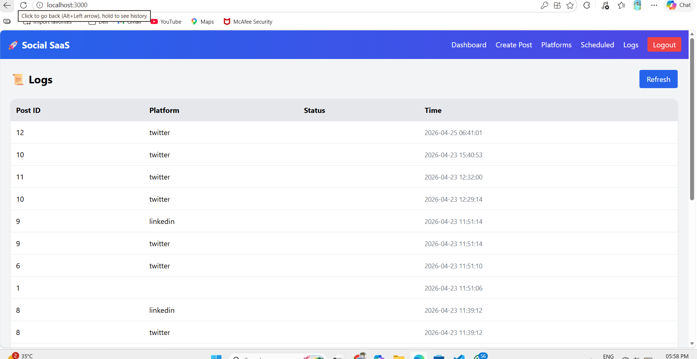
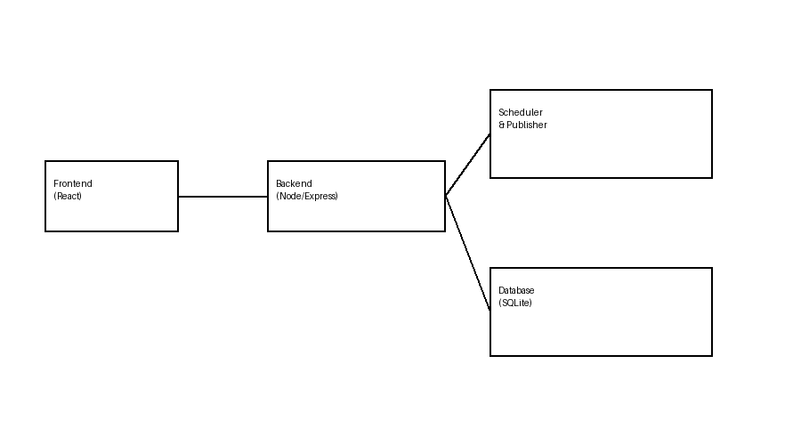

# 🚀 SocialFlow AI – Social Media SaaS Platform

A full-stack Social Media SaaS application that allows users to **create, schedule, and publish posts across multiple platforms from a single dashboard**.

---

## 📸 Screenshots

### 🏠 Landing Page



### 🔐 Login Page



### 📊 Dashboard



### 📝 Create Post



### 📜 Logs



## ✨ Features

- 🔐 Authentication (Login / Register)
- 📝 Create and manage posts
- 📅 Schedule posts for future publishing
- 🔗 Multi-platform posting (Twitter, LinkedIn, etc.)
- 🔁 Retry failed posts
- 🗑️ Delete posts
- 📊 Dashboard with status tracking
- 📜 Logs for monitoring system activity
- 🎨 Modern SaaS UI

---

## 🧠 Architecture



### Flow:

Frontend → Backend API → Scheduler → Publisher → Platform Integrations → Database

---

## 🛠️ Tech Stack

### Frontend

- React.js
- Tailwind CSS
- Axios

### Backend

- Node.js
- Express.js
- SQLite

---

## 🚀 Deployment (Render)

### Backend Deployment

1. Push code to GitHub
2. Go to Render
3. Create **Web Service**
4. Connect GitHub repo
5. Set:
   - Build Command: `npm install`
   - Start Command: `node server.js`

---

### Frontend Deployment

1. Build project:

```bash
npm run build
```

2. Deploy using:

- Render Static Site OR
- Netlify / Vercel

---

## ⚙️ Setup Instructions

### 1. Clone Project

```bash
git https://github.com/Abhi-Dadge/social-saas-platform
cd social-media-saas
```

---

### 2. Backend Setup

```bash
cd backend
npm install
node server.js
```

Runs on:

```
http://localhost:5000
```

---

### 3. Frontend Setup

```bash
cd frontend
npm install
npm start
```

Runs on:

```
http://localhost:3000
```

---

## 🔁 API Endpoints

| Method | Endpoint         | Description   |
| ------ | ---------------- | ------------- |
| POST   | /auth/register   | Register user |
| POST   | /auth/login      | Login         |
| POST   | /posts           | Create post   |
| GET    | /posts           | Get posts     |
| DELETE | /posts/:id       | Delete post   |
| POST   | /posts/retry/:id | Retry post    |
| GET    | /posts/logs      | Get logs      |

---

## 💡 Key Concepts Used

- REST API Design
- Authentication (JWT)
- Async Scheduling
- Retry Mechanism
- Modular Architecture

---

## 👨‍💻 Author

**Abhishek Dadge**

---

## ⭐ Final Note

# This project demonstrates a **real-world SaaS architecture**, including scheduling, automation, and multi-platform integration in a scalable way.
